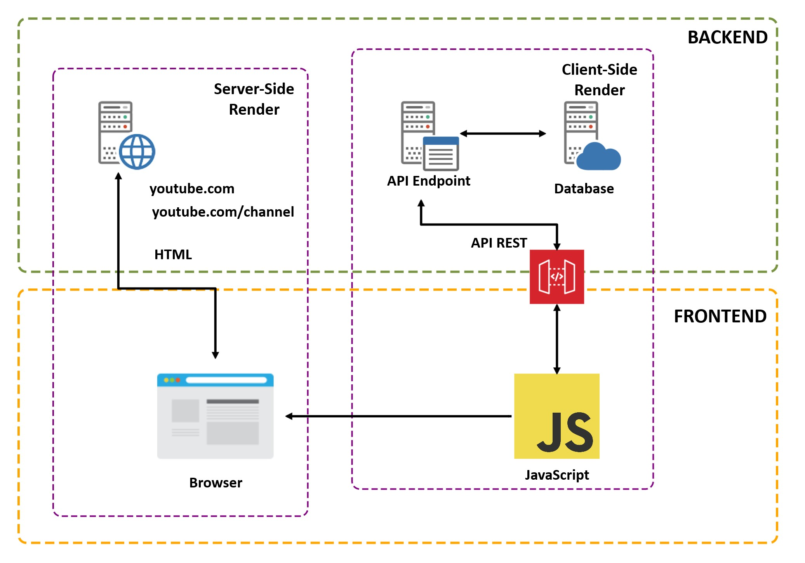

# Conceptos fundmentales de API REST

JavaScript tiene dos objetivos en el frontend:

1. Interactuar con los usuarios
2. Comunicarnos con el backend con la mayoría de preguntas que hacen los

## ¿Qué es una API REST?

**API** es el acrónimo para Application programming interface, la cual es una interfaz de comunicación entre aplicaciones, un ejemplo muy simple es conectar el frontend con el backend, para lograr esto es necesario el uso de una API REST que nos ayude a crear un _canal_ de comunicación por el cual enviar y recibir los datos de la aplicación en el backend o conectarla a una base de datos.

**REST** acrónimo de Representational State Transfer, un protocolo de API con el cual podemos conectar aplicaciones por medio del protocolo de la web HTTP.

Entonces tenemos que una API REST es una API que nos permite conectar aplicaciones entre sí, y transferir datos, por medio del protocolo HTTP.

## Flujo de comunicaciones entre usuarios, frontend y backend

