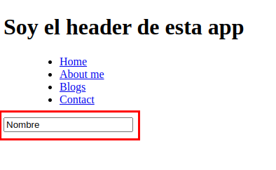
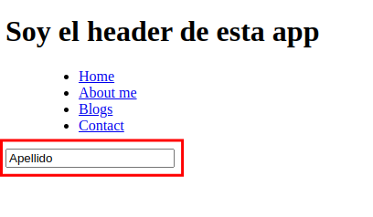
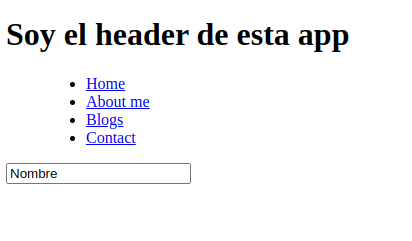
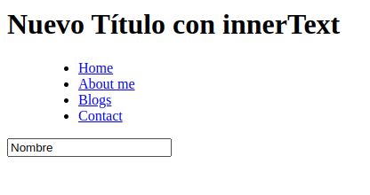
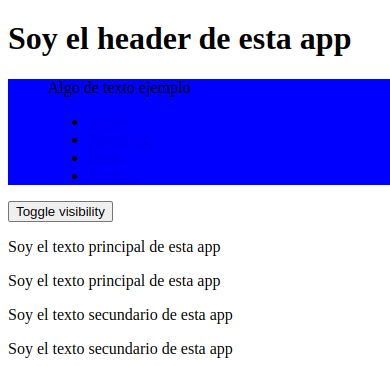
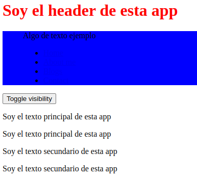
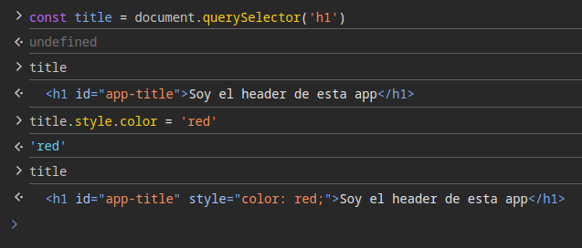
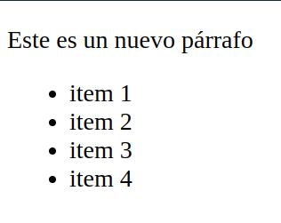

# Manipulando elementos del DOM
Para poder manipular los elementos en el DOM, podemos hacer uso del método `console.dir()` el cual nos lista todos los atributos que contiene un elemento, y así poder elegir el atributo que queremos manipular.

```javascript
const title = document.querySelector("#app-title")
console.dir(title)
```
## Modificando atributos y propiedades
Tenemos de ejemplo el siguiente documento y script:



Del cual le modificaremos un atributo a un elemento.

**1. Primero seleccionamos el elemento al que le vamos a modificar el atributo:**

Elemento:
```html
<main>
    <!-- Attributes are part of HTML, like id, class, type, value, etc -->
    <input id="input-id" class="input-class" type="text" value="Nombre">
</main>
```
Selección con JS:
```javascript
const input = document.querySelector("input")
console.log(input)
```
Resultado:
```html
<input id="input-id" class="input-class" type="text" value="Nombre">
```
**2. Después cambiamos el atributo `value` de `input`:**

```javascript
input.value
// 'Nombre'
input.value = "Apellido"
input.value
// 'Apellido'
console.log(input)
```
Resultado:



```javascript
<input id="input-id" class="input-class" type="text" value="Nombre">
```
En el ejemplo vemos que en la interfaz de usuario el atributo `value` del elemento `input` cambia cuando lo modificamos en el script, pero cuando llamamos a nuestra constante input, vemos que sigue teniendo el valor "Nombre", esto es porque lo que se esta modificando es a nivel DOM, no el atributo HTML del elemento.

<br>

## Modificando texto en HTML
Siguiendo con el mísmo ejemplo



Cambiaremos el texto del título:

```javascript
// Almacenamos el elemento en una constante 'title'
const title = document.querySelector("#app-title")

// Buscamos el texto del elemento
console.dir(title)

// Tenemos dos formas de cambiarlo, con textContent y con innerText
// Cambiando el texto con textContent
title.textContent = "Nuevo Título con textContent"
// Cambiando el texto con innerText
title.innerText = "Nuevo Título con innerText"
```

textContent:


innerText:



<br>

## Modificando estilos en HTML

### .style
Podemos agregar estilos a elementos mediante la propiedad `.style`



```javascript
const title = document.querySelector('h1')
title.style.color = 'red'
```



Pero debemos de tener cuidado con esta propiedad, si no sabemos bien en donde vamos a cambiar los estilos podemos sobre escribir estilos que no son nuestro propósito cambiar, ya que lo que hace esta propiedad es agregar el estilo en linea, sobre la etiqueta.  
Como podemos ver en el caso anterior:



Otros ejemplos:

```javascript
const menu = document.querySelector('menu');
menu.style.backgroundColor = 'red'
```


```javascript
menu.style.fontSize = '24px'
```


### className
Esta propiedad nos ayuda a acceder a la clase que exista en el elemento, pero tiene algo de cuidado también, porque si no escribimos bien lo que queremos lograr, podemos romper los estilos, ya que si el elemento ya tiene una clase, y la clase que estamos consultando es diferente, esta se sobrescribirá, y en caso de que no exista la agregará.

```javascript
menu.className = 'main-menu'
```


En nuestra hoja de estilos (en este caso en el head), ya teníamos una clase con ese nombre, y con ciertas propiedades:

```html
<style>
    .menu {
      background-color: blue;
      font-size: 16px;
    }

    .main-menu {
      color: green
    }

    .visible {
      display: block;
    }

    .invisible {
      display: none;
    }
  </style>
```

<br>

## Modificando la visibilidad de elementos HTML
### classList
Nos permite agregar clases sin rescribir las que ya tiene.
```javascript
button.addEventListener('click', () => {
    menu.classList.toggle('invisible')
    }
)
```
```html
<body>
  <header>
    <h1 id="app-title">Soy el header de esta app</h1>
    <menu class="menu">
      <p>Algo de texto ejemplo</p>
      <ul id="parent">
        <li><a href="#">Home</a></li>
        <li class="menu-items"><a href="#">About me</a></li>
        <li class="menu-items"><a href="#">Blogs</a></li>
        <li class="menu-items"><a href="#">Contact</a></li>
      </ul>
      <section></section>
    </menu>
  </header>
  <main>
    <button>Toggle visibility</button>
    <section>
      <p>Soy el texto principal de esta <span>app</span></p>
    </section>
    <section>
      <p>Soy el texto principal de esta <span>app</span></p>
    </section>
    <section>
      <p>Soy el texto secundario de esta app</p>
      <p>Soy el texto secundario de esta app</p>
    </section>
  </main>
  <script src="app.js"></script>
</body>
```

<br>

## Creación e inserción de elementos
### innerHTML e insertAdjacentElement()
Tendremos el siguiente ejemplo para poder ilustrar mejor la forma de crear e insertar elementos en el DOM


```html
<section id="contentArea">
    <p>Texto dentro de un contenedor.</p>
  </section>
  <section>
    <ul id="listArea">

      <li>item 1</li>
      <li>item 2</li>
      <li>item 3</li>
      <li>item 4</li>

    </ul>
  </section>
```

#### Creación de elementos

Tenemos dos opciones:

1. `innerHTML`: Este método nos reemplaza el elemento.
```javascript
const contentArea = document.getElementById('contentArea')
contentArea
contentArea.innerHTML = '<p>Este es un nuevo párrafo</p>'
```
```html
<section id="contentArea">
    <p>Este es un nuevo párrafo.</p>
  </section>
  <section>
```



2. `insertAdjacentHTML`: Este método nos permite seleccionar la posición en donde queremos colocar el nuevo elemento sin reemplazar el/los existente/s. Tenemos varias opciones para seleccionar la posición `beforeBegin`, `afterBegin`, `beforeEnd` y `afterEnd`
```javascript
contentArea.insertAdjacentHTML('beforeEnd', '<p>Este es un nuevo párrafo</p>')
```
```html
<section id="contentArea">
    <p>Texto dentro de un contenedor.</p>
    <p>Este es un nuevo párrafo</p>
  </section>
  <section>
```


#### Inserción de elementos

1. `innerHTML`: Se puede utilizar sin que tenga que reemplazar, pero tiene una pequeña desventaja que impacta directamente en rendimiento, ya que renderiza de nuevo el bloque o padre junto con sus hermanos en donde se encuentra el elemento agregado.

```javascript
const listArea = document.getElementById('listArea')
listArea.innerHTML += '<li>item 5</li>'
```
```html
<ul id="listArea">

      <li>item 1</li>
      <li>item 2</li>
      <li>item 3</li>
      <li>item 4</li>
      <li>item 5</li>

    </ul>
```

2. Por este motivo es mejor la utilizar `insertAdjacentHTML`
```javascript
listArea.insertAdjacentHTML('beforeEnd', '<li>item 5</li>')
```

<br>

### createElement()
```javascript
// Creamos una constante
const newPElement = document.createElement('p')
newPElement // <p></p>

// Insertamos un texto dentro de la etiqueta
newPElement.textContent = 'Fuí creado con createElement'
newPElement //<p>Fuí creado con createElement</p>

// Buscamos el lugar donde queremos insertar el elemento
document

// Insertamos el elemento
const contentArea = document.getElementById('contentArea')
contentArea.append(newPElement) // se agrega
```


Para poder insertar los elementos en un lugar específico, y no al final como en el ejemplo anterior:
- prepend
- before
- after
- append

#### prepend

```javascript
const newItem = document.createElement('li')
newItem // <li></li>
newItem.textContent = 'item 5'
newItem // <li>item 5</li>
listArea.prepend(newItem)
```


#### before

```javascript
const newItem = document.createElement('li')
newItem // <li></li>
newItem.textContent = 'item 5'
newItem // <li>item 5</li>
listArea.before(newItem)
```


#### after

```javascript
const newItem = document.createElement('li')
newItem // <li></li>
newItem.textContent = 'item 5'
newItem // <li>item 5</li>
listArea.after(newItem)
```


<br>

## Remoción de elementos
### remove()
```javascript
const firstItem = document.querySelector('li')
firstItem.remove()
```

### removeChild
```javascript
const list = document.querySelector('ul')
list.removeChild(list.firstElementChild)
```

<br>

## Clonación y reemplazo de elementos
### cloneNode()
```javascript
const contentArea = document.querySelector('#contentArea')
const originalP = contentArea.querySelector('p')
const clonedP = originalP.cloneNode(true)
contentArea.append(clonedP)
```

### replaceWith()
```javascript
const list = document.querySelector('#listArea')
list
const itemToReplace = listArea.children[2]
```

