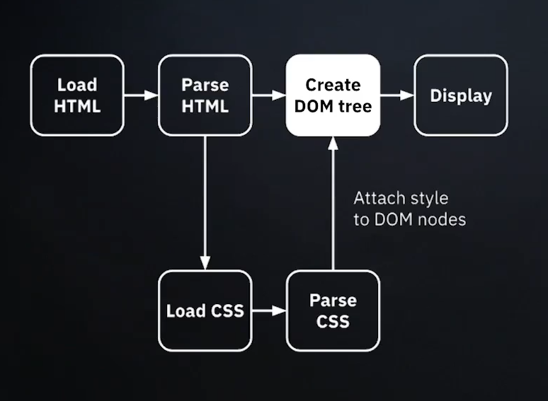
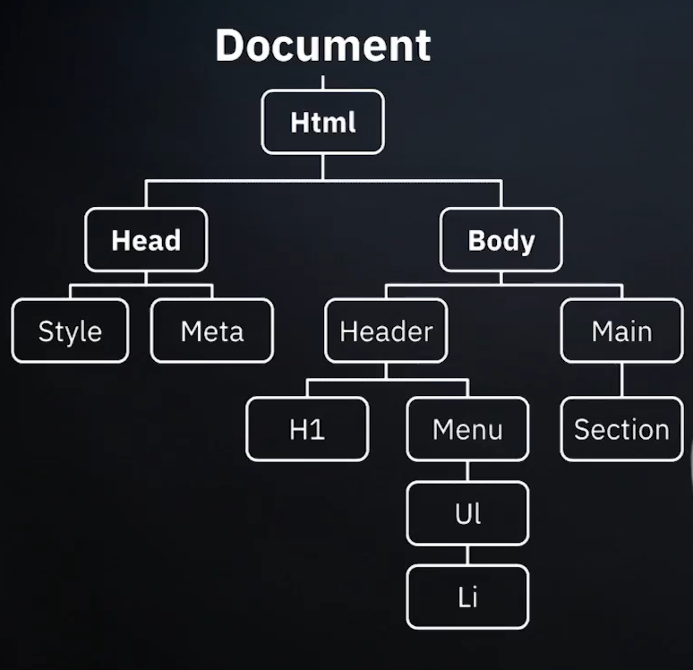

# Entendiendo el DOM

## ¿Qué es el DOM y Window Object?

### DOM
Por sus siglas en inglés, Document Object Model (Modelo de Objetos del Documento).  
Cuando ingresas una dirección URL de algún sitio en el navegador, éste se comunica con un servidor pidiendo ciertos archivos, los cuales el servidor se los manda para que pueda renderizar la página con la que se está interactuando, nos centraremos en éste paso, que es en el que se comienza a generar el DOM.



Una vez que el navegador termina de interpretar el documento html, crea un árbol en orden de jerarquía, en el cual se crean nodos de arriba hacia abajo, de los padres a hijos.  
En javascript, estos nodos serán accesibles para poder seleccionarlos y manipularlos.
Se podría considerar al DOM como una web API.



### Window Object
A la pantalla del navegador en donde vemos un sitio web, se le conoce como Window Object. Éste objeto nos da oportunidad de interactuar con otro tipo de APIs, como por ejemplo al pedir permiso al usuario de utilizar el micrófono, mandar mensajes de alerta.

<br>

## Explorando Nodos del DOM
Aquí podemos ver algunas diferencias entre el DOM y el WO que se muestran en la consola del navegador, estos dos objetos, se diferencian en los métodos que podemos utilizar en cada uno:

1. El DOM en la consola:


1. El WO en la consola:
  


<br>

# Seleccionando y accediendo a elementos del DOM
## Consultando el DOM
Para seleccionar elementos desde JS existen varias formas, puede ser por:
- **id**
- **clase**
- **etiqueta**
- **atributos**

### querySelector
Con esta función podemos consultar elementos con su atributo id, algún atributo especifico, o una etiqueta.

**Por id**
```javascript
document.querySelector("#app-title")
```

**Por etiqueta** (solo el primer elemento)  
Consultando por etiqueta con `querySelector()` siempre traerá de regreso la primera que encuentre con respecto al flujo del DOM-tree.
```javascript
document.querySelector("p")
```

**Por cualquier cosa**(pero todos los elementos)
```javascript
document.querySelectorAll(".menu-items")
```

### getElementBy

**Por id**  
Con esta función podemos consultar elementos por etiqueta o diferentes atributos
```javascript
  document.getElementById("app-element")
  ```

**Por clase** (todos los elementos)  
Obtendremos un array de todos los elementos con la misma clase
```javascript
document.getElementsByClassName("menu-items")
```

**Por etiqueta** (todos los elementos)  
También es posible obtener todos los elementos de un mismo tipo de etiqueta.
```javascript
document.getElementsByTagName("p")
```
Las consultas con getElementsBy son mucho mas rápidas que querySelector

<br>

## Navegación efectiva entre Nodos
Para poder navegar entre nodos, ya sea padre, hijos o hermanos de manera efectiva para poder manipularlos, existe un forma denominada **traversing DOM**, la cual nos ayuda a hacerlo sin tener que depender necesariamente de la jerarquía del árbol.

Podemos dividir la navegación entre nodos en 3:

- Nodos más altos
- Todos los nodos
- Nodos tipo elemento HTML

Nodos más altos | Todos los nodos | Nodos tipo elemento HTML
:---: | :---: | :---:
`html` = document.documentElement |  element.childNodes | element.Children
`head` = document.head | element.firstChild | element.firstElementChild
`body` = document.body | element.lastChild | element.lastElementChild
| | element.parentNode | element.parentElement
| | element.nextSibling | element.nextElementSibling
| | element.previousSibling | element.previousElementSibling

### Traversing DOM
Hay diferentes formas de navegar el DOM:

- A través de los hijos
- De forma descendente

Aquí hay algunos ejemplos de como llegar a ciertos elementos:
```javascript
const parent = document.getElementById("parent")
console.log(parent)

const children = parent.children
console.log(children)

const firstChild = parent.firstElementChild
console.log(firstChild)

const lastChild = parent.lastElementChild
console.log(lastChild)

const previousSibling = parent.previousElementSibling
console.log(previousSibling)

const nextSibling = parent.nextElementSibling
console.log(nextSibling)
```

Otros métodos:
```javascript
// children; // live HTMLCollection
// childNodes; // live NodeList
// firstChild; // live NodeList
// firstElementChild; // non-live HTMLCollection
// lastChild; // live NodeList
// lastElementChild; // non-live HTMLCollection
// previousSibling; // live NodeList
// previousElementSibling; // non-live HTMLCollection
// nextSibling; // live NodeList
// nextElementSibling; // non-live HTMLCollection
```

```javascript
const children2 = document.querySelector("li")
console.log(children2)

const parent2 = children2.parentNode
console.log(parent2)

const grandParent = children2.parentElement
console.log(grandParent)

// Este último es el más utilizado
const grandGrandParent = children2.closest("menu")
console.log(grandGrandParent)
```

```javascript
// parentNode; // live NodeList
// parentElement; // non-live HTMLCollection
// closest(selector); // este último es el más utilizado
```

### Tablas
**El elemento `table` soporta (además de todo lo anterior) las siguientes propiedades:**
- `table.row`: Obtiene la colección de elementos `tr` de la tabla
- `table.caption/tHead/tFoot`: Hace referencia a los elementos `caption`, `thead` y `tfoot`
- `table.tBodies`: Obtiene la colección de elementos `tbody` que por estandar debe de haber al menos uno, incluso si no es declarado explicitamente, el navegador lo agrega al DOM.

**`thead`, `tfoot` y `tbody` proveen las propiedades de las filas:**
- `tbody.rows`: devuelve la colección de elementos `tr` que tiene dentro `tbody`

**`tr`:**
- `tr.cells`: Devuelve la colección de celdas `td` y `th` dentro dl elemento `tr` dado.
- `tr.sectionRowIndex`: Obtiene la posición (indice) del elemento `tr` dado, dentro de las etiquetas `thead`/`tbody`/`tfoot`
- `tr.rowIndex`: Devuelve el número de elementos `tr` en la tabla en su conjunto (incluyendo todas las filas de la tabla)

**`td` y `th`**
- `td.cellIndex`: Obtiene el número de celdas dentro de la etiqueta `tr`