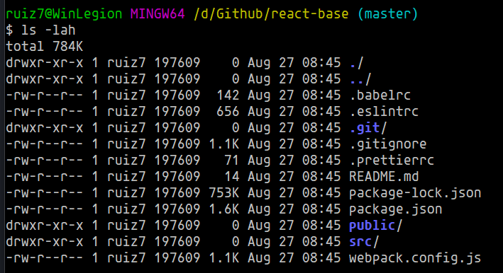
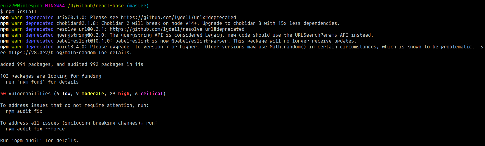
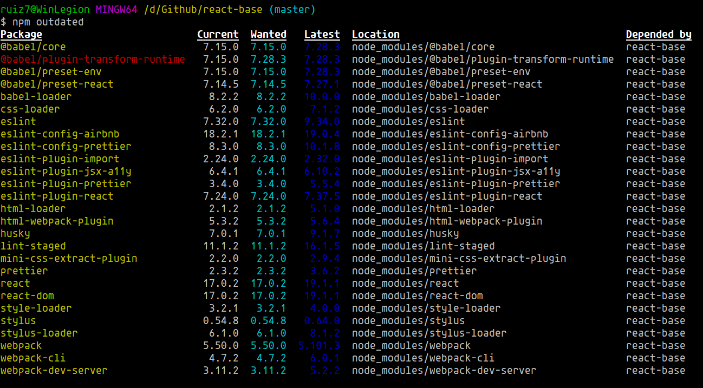
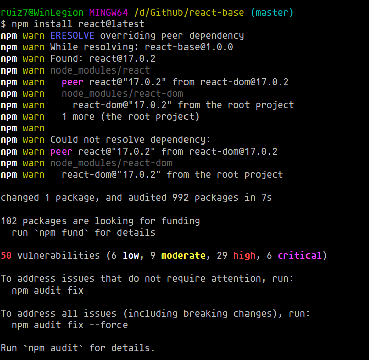

# Actualización de Dependencias

Para continuar con el tema, ocuparemos un repositorio de prueba: [react-base](https://github.com/gndx/react-base.git).



Una vez clonado vamos a instalar las dependencias

```shell
npm install
```

Aquí vemos como ya nos instaló las dependencias que nos indica el package.json, pero también notaremos que nos muestra que tiene algunas vulnerabilidades, esto puede ser debido a que el proyecto tiene algunos años y no se a actualizado.



Para verificar cuales son las dependencias que necesitan actualización utilizaremos el parámetro `outdated`

```shell
npm outdated
```

Aquí vemos que casi todas las dependencias necesitan actualizar



Probemos a actualizar _react_

```shell
npm install react@latest
```

Esto nos muestra un error, debido a conflictos entre dependencias, nos dice que react depende de otros paquetes que necesitan ser actualizados, en este caso tendremos que actualizar react-dom antes de actualizar react.


