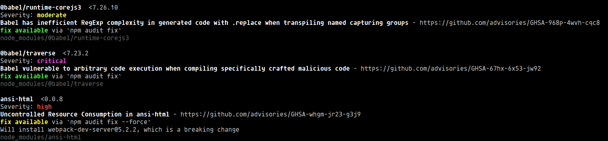

# Seguridad y solución de problemas

En la gestión de paquetes a veces nos podemos encontrar con vulnerabilidades que debemos resolver, para eso podemos utilizar el parámetro `audit`.

```shell
npm audit
```

Esto nos mostrará más a detalle las vulnerabilidades, estas pueden ser moderadas, altas o críticas.



Para resolver estas vulnerabilidades utilizaremos `audit fix`

```shell
npm audit fix
```

En caso de que aún permanezcan vulnerabilidades, podemos usar este mismo comando pero con el flag `--force`

```shell
npm audit fix --force
```
