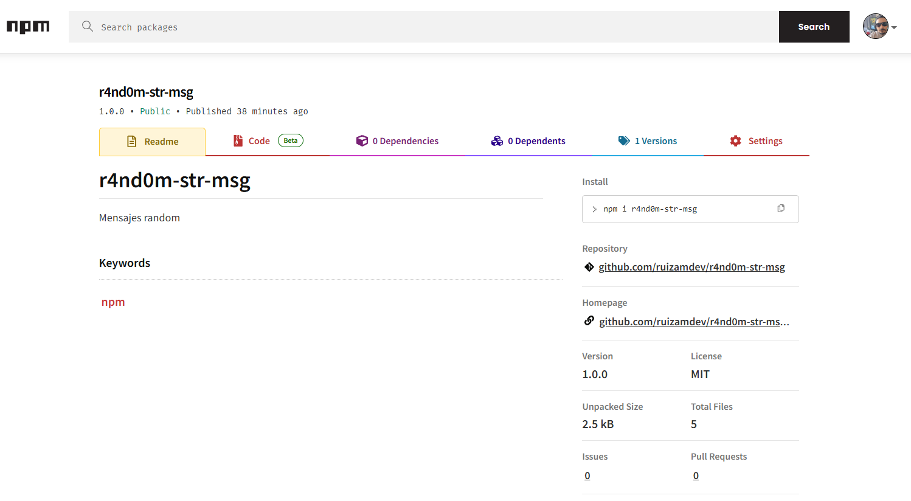

# Crear un paquete de NPM y publicarlo

Para crear un paquete debemos de crear primero un repositorio, en este caso lo hemos hecho en github.

Ya finalizada la programación del paquete y su respectivo repositorio, para poder publicarlo debemos de testearlo localmente.

Con el siguiente comando enlazamos el paquete a los repositorios de NPM, esto de manera local.

```shell
npm link
```

Una vez enlazado, podemos instalarlo de la misma manera que cualquier otro paquete, pero en vez de agregar el nombre del paquete solamente, se agrega la ruta en donde está almacenado localmente en nuestra computadora.

```shell
npm install -g /d/Github/r4and0m-str-msg
```

Así ya podemos probar el proyecto.
Ya testeado, para poder publicarlo simplemente hacemos login desde la terminal.

```shell
npm adduser
```

Esto nos abrirá una ventana del browser para autenticar nuestro usuario. Ya logueado podemos publicarlo.

```shell
npm publish
```


